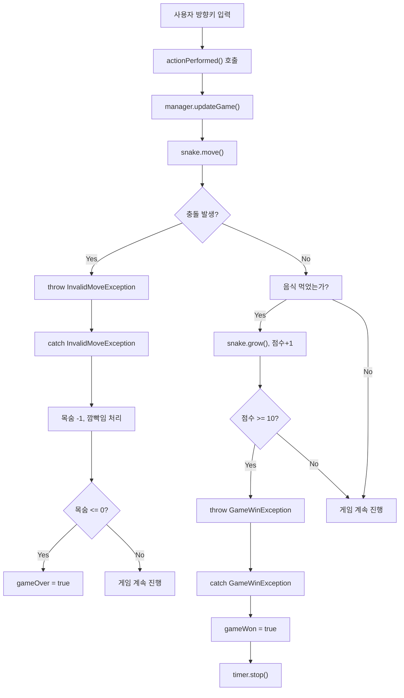
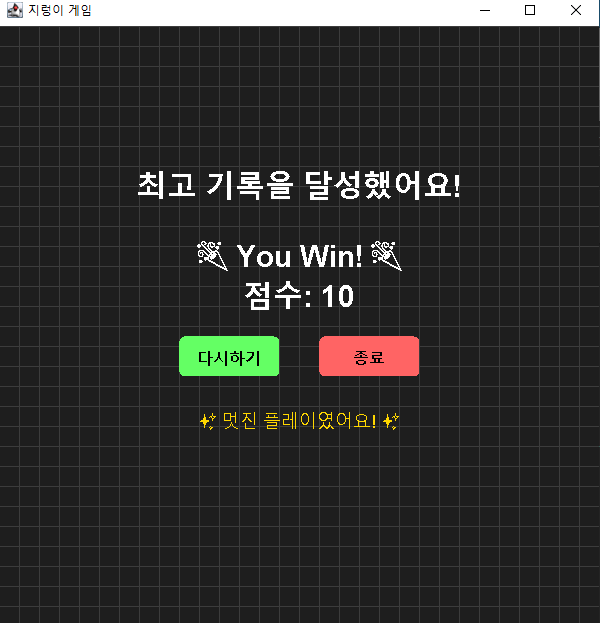
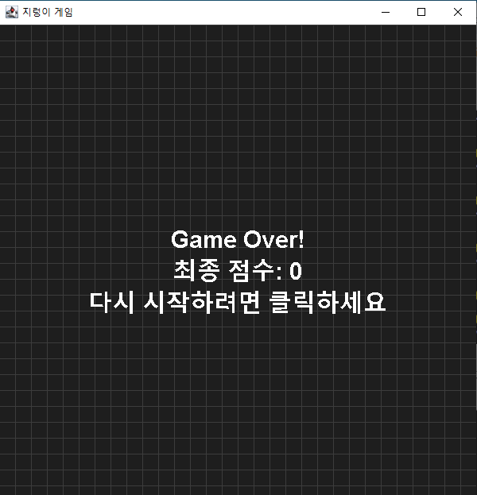

<h1>Java_MiniProject</h1>
<p>Swing, JPanel, JFrame 을 활용한 지렁이 게임</p>

<h2> 구현된 주요 기능</h2>
기본 게임 플레이:

뱀이 방향키(↑ ↓ ← →)로 조종 가능

음식(빨간색 원)을 먹으면 뱀의 길이가 증가하고 점수 상승

게임 클리어 조건(점수 10점 이상) 달성 시 승리 처리

게임 요소:

장애물 시스템(파란색 블록) - 주기적으로 생성되며 충돌 시 목숨 감소

목숨 시스템(하트 아이콘) - 총 3개의 목숨, 모두 잃으면 게임 오버

점수 시스템 - 음식 먹을 때마다 1점 증가

시각적 효과:

충돌 시 뱀 깜빡임 효과

시작 화면, 게임 오버 화면, 승리 화면 구분

그리드(격자) 배경

게임 제어:

게임 속도 점진적 증가(음식 먹을 때마다 속도 증가)

재시작 기능

<h2>Project UML Class Diagram </h2>


## 🔄 상속 및 인터페이스 구현

이 프로젝트에서 클래스들은 다음 인터페이스를 구현하거나 상속받아 주요 기능을 수행합니다.

```java
// 뱀 움직임 구현용 인터페이스
public interface Movable {
    void move();
}

// Snake 클래스는 Movable 인터페이스 구현
public class Snake implements Movable {
    @Override
    public void move() {
        // 뱀 이동 처리
    }
}

// 게임 패널은 타이머와 키보드 이벤트 처리
public class GamePanel extends JPanel implements ActionListener, KeyListener {
    @Override
    public void actionPerformed(ActionEvent e) {
        // 타이머 이벤트 처리
    }

    @Override
    public void keyPressed(KeyEvent e) {
        // 키보드 입력 처리
    }

    // 나머지 키 이벤트 메서드들...
}
```

<h2>구현 화면</h2>
<h3>게임 시작 전</h3>


<p>게임규칙과 키를 알려주는 메세지를 보여줍니다.</p>

<h3> 게임 플레이 </h3>


<p>시간이 지나면 장애물이 늘어나고 장애물을 피해 아이템을 획득합니다.</p>

<h3>🚨예외 처리 흐름도(Exceptions)</h3>



⚙️ 예외 처리 흐름 설명
이 Snake 게임은 명확한 예외 기반 흐름 제어를 통해 게임 상태를 처리합니다.

✅ GameWinException
발생 위치: updateGame() 내부

상황: 게임 승리 조건(예: 모든 미션 수행 혹은 일정 점수 도달 등)이 만족되었을 때 발생

처리 내용:

gameWon 상태를 true로 설정

타이머를 정지하여 게임을 종료

승리 메시지 출력

🎯 목적: 게임이 명확히 승리 조건으로 종료되었음을 처리

❌ InvalidMoveException
발생 위치: updateGame() 내부

상황: 뱀이 벽, 몸, 장애물 등과 충돌한 경우

처리 내용:

목숨(lives) 1 감소

isBlinking 상태로 충돌 위치 깜빡이기 시작

목숨이 0 이하가 되면 gameOver = true로 게임 종료

💥 목적: 패배 조건일 경우를 감지하고, 생명 기반 로직으로 게임을 이어가기

## 🖼 게임 결과 예시

- 게임 OVER 화면
  

- 게임 승리 시 화면  
  

<h2>시연 영상</h2>


