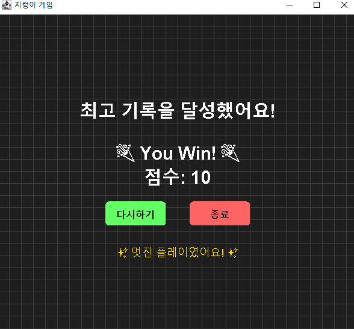

# 🐍 Java Mini Project: 지렁이 게임 (Snake Game)

> Java Swing 기반 클래식 지렁이 게임  
> `JPanel`, `JFrame` 등을 활용한 직관적인 UI와 구조적인 예외 처리 구현

---

## 🎮 주요 기능

- 🎮 **뱀 조작**: 방향키 `↑ ↓ ← →`로 이동
- 🍎 **음식(빨간 원)**: 먹을 때마다 길이 증가, 점수 +1, 속도 상승
- 🧱 **장애물(파란 블록)**: 주기적으로 생성되며 충돌 시 목숨 감소
- ❤️ **목숨 시스템**: 하트 3개, 모두 잃으면 게임 오버
- 🏁 **승리 조건**: 점수 10점 달성 시 승리 처리
- ✨ **시각 효과**: 충돌 시 뱀 깜빡임, 시작/오버/승리 화면 제공
- 🎨 **배경**: 그리드(격자) 스타일
- 🔄 **게임 제어**: 점진적 속도 상승, 재시작 기능 포함

---

## 🧩 클래스UML 구조 및 인터페이스


```java
// 뱀의 움직임을 정의하는 인터페이스
public interface Movable {
    void move();
}

// Snake 클래스는 Movable을 구현
public class Snake implements Movable {
    @Override
    public void move() {
        // 이동 로직 구현
    }
}

// GamePanel은 게임의 메인 로직을 처리하는 클래스
public class GamePanel extends JPanel implements ActionListener, KeyListener {
    @Override
    public void actionPerformed(ActionEvent e) {
        // 타이머 이벤트 처리
    }

    @Override
    public void keyPressed(KeyEvent e) {
        // 방향키 입력 처리
    }

    // 나머지 키보드 이벤트 메서드 생략
}

```

## ⚠️ 예외 처리 흐름

### ✅ GameWinException

- **발생 조건**: 점수 10점 이상 도달 시
- **처리 내용**: `gameWon = true`, 타이머 정지, 승리 메시지 출력

### ❌ InvalidMoveException

- **발생 조건**: 벽, 장애물, 자기 몸과의 충돌
- **처리 내용**: 목숨 -1, 뱀 깜빡임 효과, 목숨 0일 경우 `gameOver = true`

---

## 📈 예외 처리 흐름도 (Mermaid)


## 🖼️ 게임 화면

### 🟢 시작 화면

> 게임 시작 전, 게임 규칙 및 조작 키를 안내하는 화면입니다.


---

### 🔵 게임 플레이

> 음식(빨간 원)을 먹고 장애물(파란 블록)을 피하며 점수를 올립니다.  
> 시간이 지날수록 장애물이 증가하고, 난이도가 점차 상승합니다.


---

### ❌ 게임 오버 화면

> 목숨(하트)이 모두 소진되면 게임 오버 화면이 출력됩니다.


---

### 🏆 게임 승리 화면

> 점수 10점을 달성하면 승리 처리되어 축하 화면이 나타납니다.



---

## 🎥 시연 영상

> 아래 이미지를 클릭하거나 연결된 영상을 통해 게임 흐름을 확인할 수 있습니다.

※ `영상_링크_또는_유튜브_주소` 부분을 실제 영상 링크로 교체해 주세요.

---
