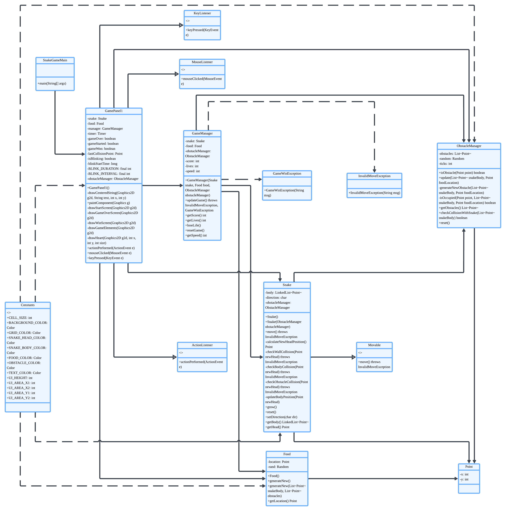
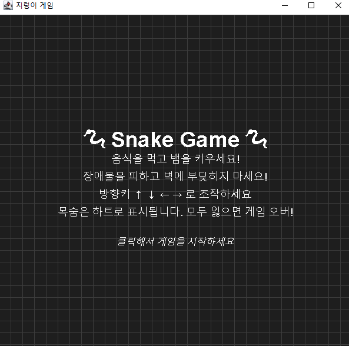

<h1>Java_MiniProject</h1>

Swing, JPanel, JFrame 을 활용한 지렁이 게임

<h2> 구현된 주요 기능</h2>
기본 게임 플레이:

뱀이 방향키(↑ ↓ ← →)로 조종 가능

음식(빨간색 원)을 먹으면 뱀의 길이가 증가하고 점수 상승

게임 클리어 조건(점수 10점 이상) 달성 시 승리 처리

게임 요소:

장애물 시스템(파란색 블록) - 주기적으로 생성되며 충돌 시 목숨 감소

목숨 시스템(하트 아이콘) - 총 3개의 목숨, 모두 잃으면 게임 오버

점수 시스템 - 음식 먹을 때마다 1점 증가

시각적 효과:

충돌 시 뱀 깜빡임 효과

시작 화면, 게임 오버 화면, 승리 화면 구분

그리드(격자) 배경

게임 제어:

게임 속도 점진적 증가(음식 먹을 때마다 속도 증가)

재시작 기능

<h2>Project UML Class Diagram </h2>

<h2>구현 화면</h2>

게임 시작 전 

<h2>🚨예외 처리(Exceptions)</h2>

InvalidMoveException:

Snake 클래스에서 발생

벽 충돌(checkWallCollision), 자기 몸 충돌(checkBodyCollision), 장애물 충돌(checkObstacleCollision) 시 발생

GameManager.updateGame()에서 처리 → 목숨 감소

GameWinException:

GameManager.updateGame()에서 발생

점수가 10점 이상일 때 발생

GamePanel1.actionPerformed()에서 처리 → 승리 화면 표시

<h2>🔄 상속(Implements) 관계</h2>
Movable 인터페이스:

Snake 클래스에서 implements Movable

move() 메서드 구현 필수

<h2>시연 영상</h2>

